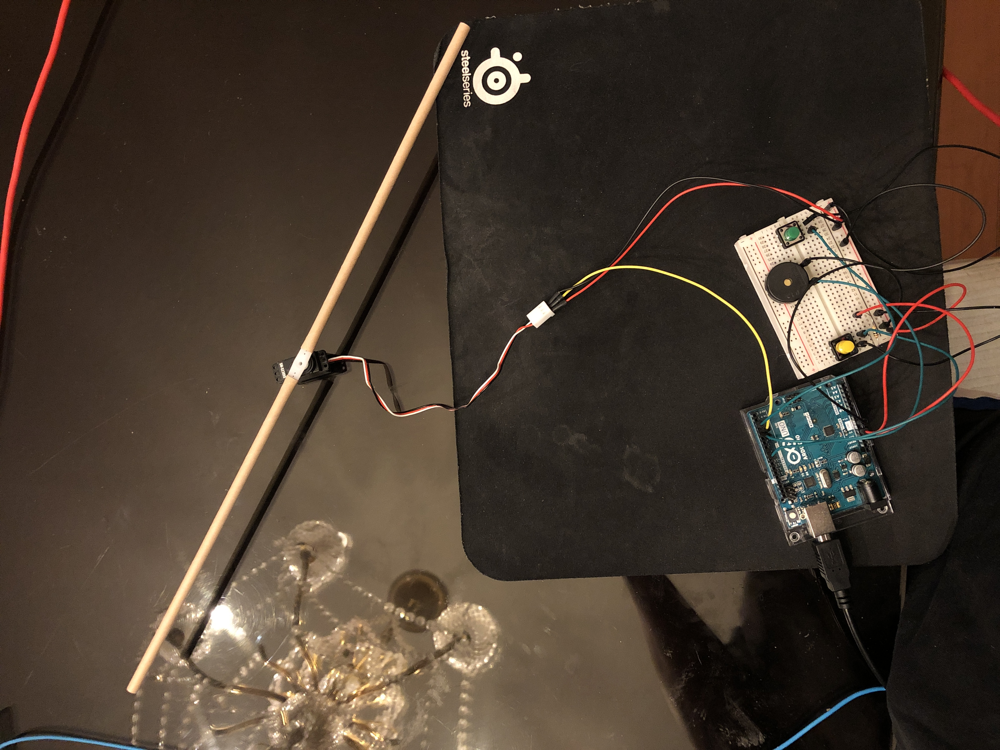

I call this instrument the spinning stick because the two straws fixated onto the servo motor resembles that of a stick's shape; depending on the servo's angle, the piezo motor will play a different tone. You can press the yellow button to change the servo motor's angle which will then change the tone that is playing out of the piezo motor. However, you will also notice that when you press the green button, it causes the piezo motor's tone to become much softer and crisper. By playing around with these two buttons, you are able to create a song from a combination of tones and rhythms.

One of the biggest problems I had was trying to figure out the best way to combine all of these different components within one cohesive instrument; after reading up on some tutorials, including this one from [instructables](https://www.instructables.com/id/Servo-Motor-Arduino/), I was able to figure out a good way to code it so that the buttons, servo motor, and piezo motor were interconnected with one another.

Here is the [schematic](schematic.jpg), the [electronics](electronics.jpg), the [video](https://youtu.be/1EAv5VAChzc), and the [code](instrument.ino).
