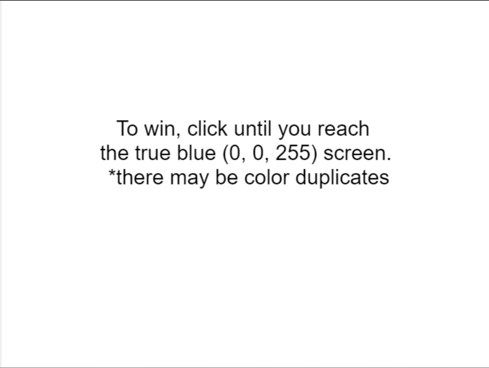

For the game assignment, I decided to make a really simple game as I had another midterm project due the same day. 
I called my game the "True Blue Game" because you keep clicking the screen until the background turns into the true blue color.

It was overall a pretty smooth process with only a few bugs here and there; I had some difficulty trying to figure out how to check if 
the background was the game winning color, but figured out you couldn't compare a color on its own within an if statement. After I bound the color to a variable, everything
went super smooth. Great experience and was really fun! You can play it .
