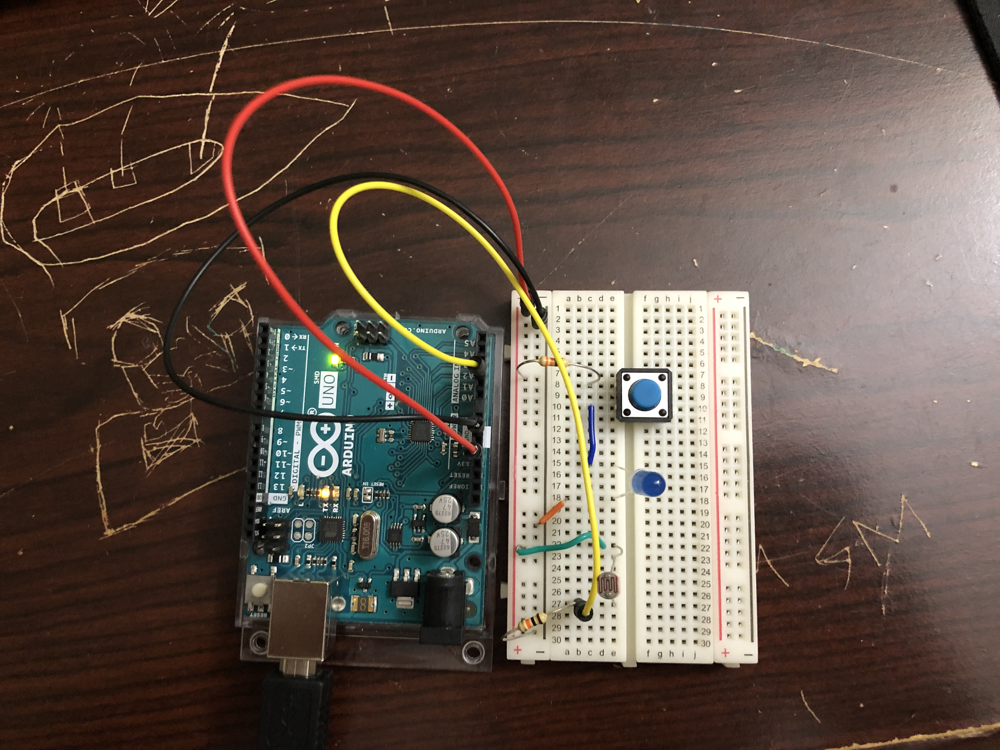

[video](video.mov)

For this project, I was trying to figure out a way to combine both the LED lit by the button and also the LED lit by the photoresistor in a creative and fun manner; I noticed that when I covered the photoresistor with my hand, it would decrease the analog data by a lot and vice versa when I lit the LED that was next to it with the button. I then had the idea to make a "game" where the analog LED would be turned off most of the time and would only light up under certain lighting circumstances.

To create the perfect circumstances, the user would need to press the button to light up the nearby LED and also cover it slightly with their hand. The analog LED would not light up under natural light, hand-covered light, or the digital LED themselves, it would need to be a combination of them all.

The only part I had a bit of trouble with was drawing the [schematic](schematic.jpg) because I had never drawn one before; I was a bit confused on where to put the button as in some schematics I saw that it was on the same side as the LED. I drew them seperately because I feel like the button is an input but we will see what the professor says.

Overall, an interesting project and looking forward to learning more about the arduino and circuits!
