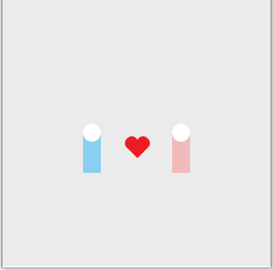

The environment I chose to draw was being with my girlfriend. I chose to draw this environment because even though I have visited many amazing places myself, visiting those same places with her makes the experience so much more meaningful. The distance between us caused by Covid has also made me more appreciative of the time we had spent together in person. It's a pretty simple portrait with a minimalistic depiction of me and my girlfriend coupled with a heart in the middle to illustrate our relationship.

The main difficulty of this project was figuring out how to draw the heart. I looked up some ways to draw the heart directly within Processing, but the code was a bit too complicated for me to parse; I then found out that you could import .svg files directly from Illustrator using the PShape function. However, when I tried to draw the heart in Illustrator the first time, the .svg file was not exported correctly so it didn't work on processing; I had to redraw the heart a few times before it finally worked. Also, I found out that if the heart size was too small, Processing would cut off 90% of it (not sure why this happens). Other than that, it was a bit difficult making sure everything was positioned right using my eye since there were no grids within the drawing but overall was a fun experience!
